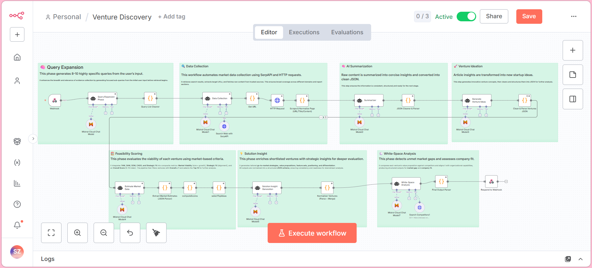
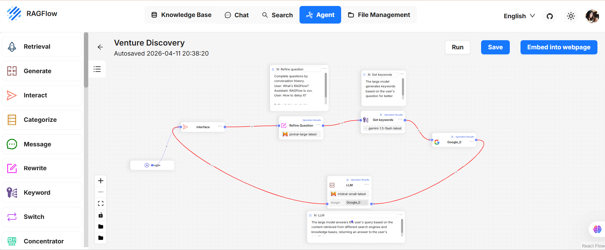
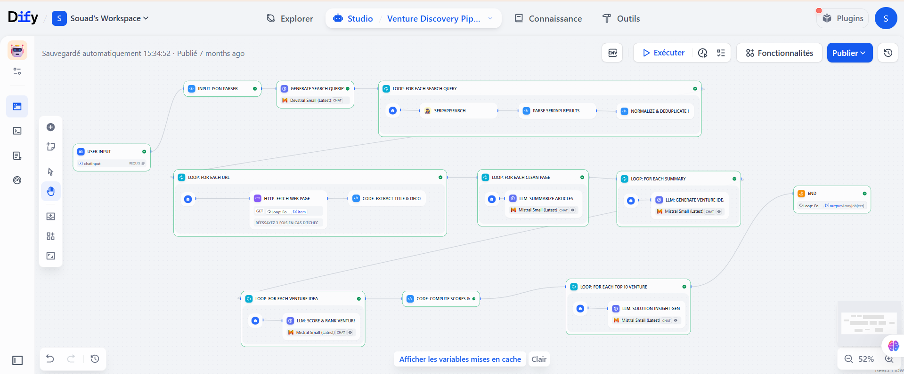

# 🚀 Venture Discovery AI System

## 📌 Overview

This project presents a **full-stack AI system** for automated **venture discovery**, combining:

- 🤖 Large Language Models (LLMs)
- 🔄 Multi-agent reasoning (CrewAI)
- ⚙️ Low-code / no-code workflows (n8n, Dify, RAGFlow)
- 🖥️ Interactive frontend (React)

The system automates the process of **generating, analyzing, and evaluating startup ideas**, transforming raw market data into **actionable business insights**.

📄 Full Thesis: [Download Report](report/Rapport_MFE.pdf)

---

## 🎯 Problem Statement

Venture discovery is traditionally:

- ❌ Time-consuming  
- ❌ Requires strong expertise  
- ❌ Not accessible to non-technical users  

This project addresses these challenges by building an **end-to-end AI pipeline** that:

- Automates market research  
- Generates startup ideas  
- Evaluates feasibility  
- Identifies market opportunities  

---

## 🧠 System Architecture

### 🔵 n8n Workflow


---

### 🟣 RAGFlow Workflow


---

### 🟢 Dify Workflow


---

## ⚙️ How the System Works

1. **User Input**
   - Define focus area (industry/domain)
   - Optional company context  

2. **Query Expansion**
   - Generate optimized search queries using LLMs  

3. **Data Collection**
   - Retrieve web data (trends, competitors, insights)  

4. **Summarization**
   - Convert raw content into structured knowledge  

5. **Idea Generation**
   - Generate startup ideas using AI  

6. **Market Evaluation**
   - Estimate:
     - TAM / SAM / SOM  
     - Growth potential  
     - Strategic fit  

7. **Scoring & Ranking**
   - Rank ventures based on feasibility  

8. **Solution Insights**
   - Value proposition  
   - Key features  
   - Go-to-market strategy  

9. **White-Space Analysis**
   - Identify market gaps  
   - Compare competitors  

10. **Final Output**
   - Structured JSON with ranked opportunities  

---

## 🧩 Technologies & Platforms

### 🔹 Backend (AI System)
- Python  
- CrewAI (multi-agent orchestration)  
- FastAPI  
- LLM APIs (Mistral / OpenAI)  

### 🔹 Frontend
- React (Vite)  
- Interactive UI  

### 🔹 Workflow Platforms
- n8n → automation pipeline  
- Dify → LLM orchestration & evaluation  
- RAGFlow → retrieval-augmented workflows  

---

## 🖥️ Run the Project

### 🔹 1. Clone repository

```bash
git clone https://github.com/Souadzriouil/venture-discovery-ai-system.git
cd venture-discovery-ai-system
```

---

### 🔹 2. Run Backend (CrewAI)

```bash
cd crewai-backend
pip install -r requirements.txt
uvicorn api:app --reload
```

---

### 🔹 3. Run Frontend (React)

```bash
cd crewai-backend/venture-ui
npm install
npm run dev
```

👉 Open:
```
http://localhost:5173
```

---

## 📊 Example Output

The system generates structured venture insights including:

- Feasibility score  
- Market size  
- Growth potential  
- Strategic fit  
- Business insights  

---

## 🚀 Key Features

- ✅ Multi-agent AI reasoning  
- ✅ Automated web data collection  
- ✅ AI-powered startup idea generation  
- ✅ Market analysis (TAM, growth, fit)  
- ✅ White-space opportunity detection  
- ✅ Cross-platform implementation  
- ✅ Full-stack system (frontend + backend)  

---

## 🧪 Evaluation

### 🔹 Quantitative
- Token usage  
- Latency  
- Workflow complexity  

### 🔹 Qualitative
- Usability  
- Stability  
- Flexibility  

📊 Result:  
No single platform is universally optimal — each platform offers trade-offs depending on the use case.

---

## 🧪 Use Cases

- 💡 Startup idea generation  
- 📊 Market opportunity analysis  
- 🧠 Business strategy support  
- 🚀 Innovation automation  

---

## ⚠️ Note

API keys are not included for security reasons.  
Replace `your_api_key_here` with your own credentials before running the project.

---

## 👩‍💻 Author

**Souad Zriouil**  
AI Engineer | Data Scientist | Machine Learning | NLP | LLM  

[](https://github.com/Souadzriouil)


---

## ⭐ Support

If you found this project useful, feel free to ⭐ the repository!
